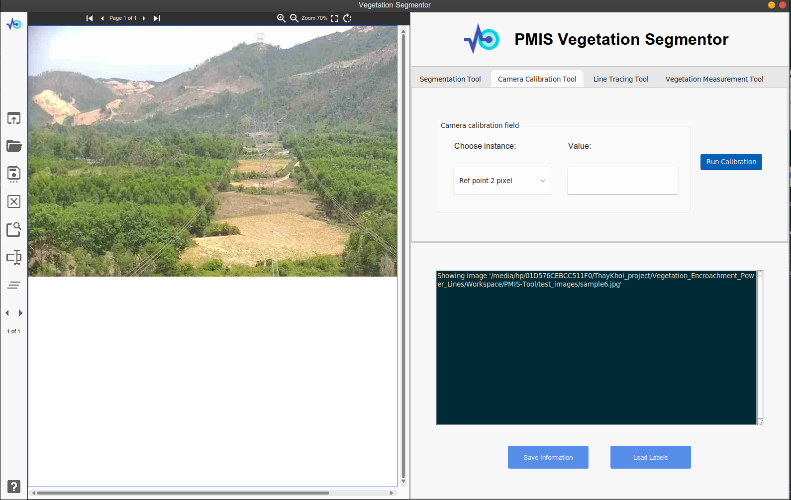

# All in one packet

This is a part of the [PMIS System](http://pmisptc2.com.vn:3000/login).

I'm not familiar with JS canvas, so I decided to build up a small TkInter application to use all the things I have 
to perform the prediction. 

## Problem Analysis
Targets:

Build the Camera Calibration tool. I've implemented the core algorithm. The parameters need to be considered to
perform this Algorithm:
  * Principal Point (Currently this will be achieved by getting the center of the current image)
  * 2 Vanishing point:
    * Each vanishing point, we need 2 line-pair. **CONSIDER THIS !!!**
    * 2 Points for each line. (in pixel) **CONSIDER THIS**
    * 2 Point on Top-left and Top-right of the Pylon (in pixel). For each point, we give the information about the 3D coordinate! **CONSIDER THIS !!!**

  * Overall, we need: 4 lines ~ 8 points (required pixel value ~ canvas interaction), 2 points (required pixel value ~ canvas interaction) 

## Task list
- [x] Use the Idea of InvoiceNet to build the application, first I need to clone the InvoiceNet GUI
- [x] Enhance the GUI by using Nanoet GUI as template and use Tkinter Designer application
- [x] Embed the VegSeg to the segmentation process
- [x] Allow user choose fields and then segmentation on these fields
- [x] Enhance the UI by adding more tabs

* Add UI and Functional code for Camera calibration task:
  - [x] Add UI
  - [x] Functional Code
- [ ] Add UI and Functional code for Line tracing task 
- [ ] Add UI and Functional code for Measurement task

## Result (Completed on Feb 12, 2022)
* Base on [InvoiceNet GUI](https://github.com/naiveHobo/InvoiceNet) and then do some modification with [Sun-Valley Tkinter theme](https://github.com/rdbende/Sun-Valley-ttk-theme)

* Change the original app to Image base application instead of PDF base application.

* Use Pytorch model to perform segmentation

## Result (Completed on Feb 14, 2022)
* Camera Calibration Tab

## Problems
- [x] I can not read User input text inside Entry in Tkinter: resolved, because I deleted it's value before read it (stupid mistake)
